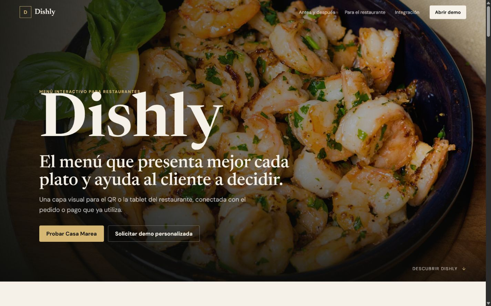
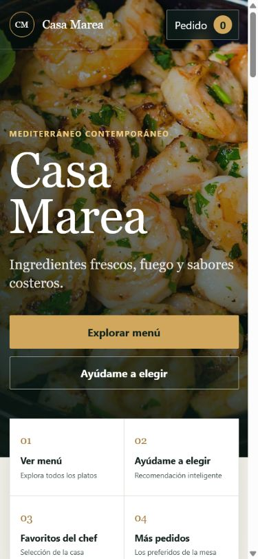

# Dishly · Demo comercial de menú interactivo

Prototipo estático preparado para presentar Dishly a restaurantes. Funciona en GitHub Pages y separa claramente:

- `index.html`: presentación comercial para el propietario.
- `menu.html`: experiencia del comensal para el restaurante ficticio Casa Marea.

## Verlo localmente

Desde PowerShell:

```powershell
cd "C:\Users\cdelg\OneDrive\Escritorio\CLAUDE TERMINAL\demo-restaurant-menu-"
node scripts\serve.mjs
```

Después abre:

- Presentación: `http://127.0.0.1:4173/`
- Menú: `http://127.0.0.1:4173/menu.html`

También puede abrirse `index.html` directamente, pero el servidor local reproduce mejor el comportamiento de GitHub Pages.

## Funciones incluidas

- Presentación comercial breve con antes/después, flujo, integración y CTA.
- Teaser interactivo del panel del restaurante con datos marcados como demostración.
- Formulario comercial validado localmente, sin envío externo.
- Menú visual con categorías, disponibilidad y platos agotados.
- Video gastronómico en loop con reproducción inteligente y fotografía de respaldo.
- Recomendador basado en reglas con explicación del resultado.
- Ingredientes, alérgenos y posible contaminación cruzada estructurados.
- Confirmación obligatoria para alergias escritas manualmente.
- Personalizaciones, extras, notas, cantidades y edición desde el carrito.
- Impuesto configurable, mesa de demostración y total estimado.
- Recorrido visual de transferencia simulada al sistema del restaurante.
- Navegación por teclado, foco visible, cierre con Escape y soporte para movimiento reducido.

## Configuración de la demo

Los platos y reglas están en `assets/js/menu.js`.

```js
const DEMO_CONFIG = {
  taxRate: 0.0825,
  defaultTable: 12,
  destinationName: "POS / sistema configurado",
};
```

Los destinos comerciales se centralizan al inicio de `assets/js/pitch.js`. Mientras no se configuren, los CTA abren un formulario local y nunca afirman que la información fue enviada.

## Verificación

Ejecuta:

```powershell
node --check assets\js\menu.js
node --check assets\js\pitch.js
node scripts\check.mjs
```

La revisión manual cubre presentación, menú, categorías, detalles, personalizaciones, carrito, recomendaciones, alergias, plato agotado, simulación POS y anchos de `320`, `375`, `390`, `430`, `768` y `1440` px.

## Publicación

El proyecto usa rutas relativas y no necesita compilación. Para GitHub Pages, publica la raíz de la rama seleccionada. La entrada principal seguirá siendo `index.html` y el menú estará en `menu.html`.

## Límites actuales

Esta es una demo comercial. No incluye backend, autenticación, base de datos, IA generativa, analítica real, pagos, envío de formularios ni conexión a POS. El carrito se conserva únicamente en `localStorage`. Los precios, mesas, disponibilidad y métricas son ficticios.

Antes de producción deben configurarse contacto y analítica, validar legalmente el tratamiento de alérgenos, sustituir o licenciar definitivamente los recursos visuales y construir la integración con el sistema real del restaurante.

La fotografía del branzino procede de [Pexels, foto 6046671](https://www.pexels.com/photo/grilled-fish-in-a-plate-6046671/). El resto de recursos visuales se conserva como material de demostración y debe someterse a una revisión final de licencias antes de un uso comercial.

## Capturas




